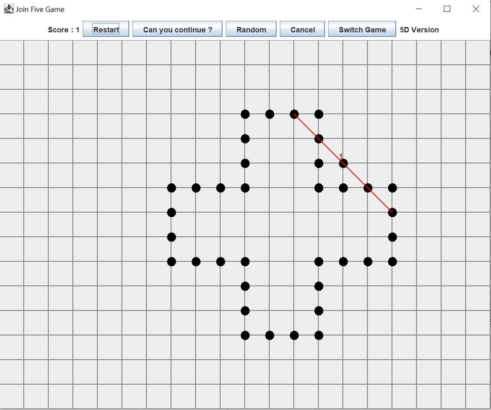

# Morpion_Solitaire

Le morpion solitaire est un casse-tête dont le but est de créer un maximum d'alignements. Les règles du jeu sont disponibles [ici](https://fr.wikipedia.org/wiki/Morpion_solitaire). Il s'agit un projet pour le cours de Java à l'université Paris Dauphine - M1 MIAGE.

## Image du morpion solitaire :

## UML du Morpion Solitaire : 

